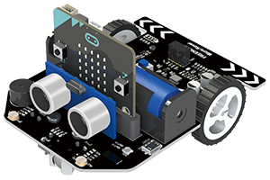

# Rover

Freenove Micro:Rover Extension for Makecode.

## API
### LEDs
Function | Description
--- | ---
Brightness(255) | Set the brightness of all RGB LEDs on the Rover.
(LED1) show (red) | Set specific RGB LED to a specific color.
All LED show (red) | Set all RGB LED to a specific color.
(Color) | Color palette provides 16 kinds of colors.
h(0) s (99) l (50) | The HSL color picking model returns the RGB color value.
(LED1) | RGB LED combination selection list.
(red) | Common color list provides 10 kinds of colors
red(128) green(128) blue(128) | The RGB color picking model returns the RGB color value.

### Motors
Function | Description
--- | ---
Move speed(50) | Set the two motors at the same speed to makes the Rover move forward or backward.  The positive value is for forward and the negative value is for backward.
Speed left(50) right(50) | Set the speed of the left and right motors to make the Rover move or turn
Motor (M1) speed(50) | Set the speed of only one motor (M1 or M2).
(Stop) all motors | Make two motors stop or brake at the same time.
(Stop) motor (M1) | Make only one motor (M1 or M2) stop or brake.

### Sensors
Function | Description
--- | ---
(distance) | Start the ultrasonic ranging module and return the measured distance.  This block is a time-consuming block. If you use this block multiple times in a short time,  you need use a variable to save the returned distance value.
(line-tracking value) | Returns the value of the line-tracking Sensor.
(linght-tracing value) | Returns the value of the light-tracing Sensor.
(battery voltage) | Returns the battery voltage value.

### Commands
Function | Description
--- | ---
Set CMD to ("") |  Set CMD as a string and parse it into CMD'order' and CMD'parameters'. And store them in 'CMD'order>' and 'ArrayList<paramters>' accordingly.
CMD'order' | Return the parsed command.
ArrayList'paramters' | Return an array in which parsed parameters are stored.
(count of paramters) | Returns the number of parsed parameters.
CMD'order' id (MOVE) | bool. Determine whether CMD < order > is the currently specified command.
CMD'Paramter' at (0) | Gets the specified parameter in the parameter array.
CMD'order' (MOVE) CMD'Paramter'(0) | Combine a specified command with a specified parameter. It is used when sending a command.
set rover mode to (0) | Set a variable to represent the mode of Rover.
Rover mode is (Mode_None) | bool. Judge if the Rover mode variable is the specified mode.
(MOVE) | Command/action list.
(Mode_None) | Rover mode list.

## License

MIT

## Supported targets

* for PXT/microbit

